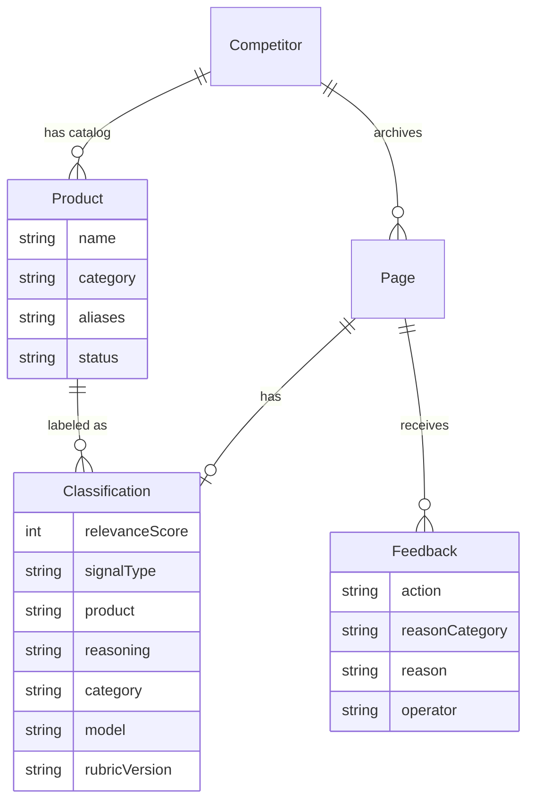
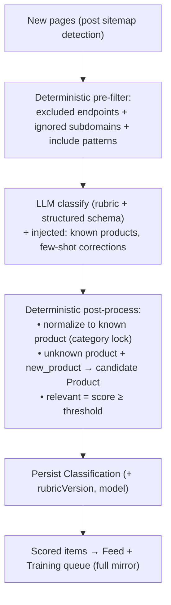
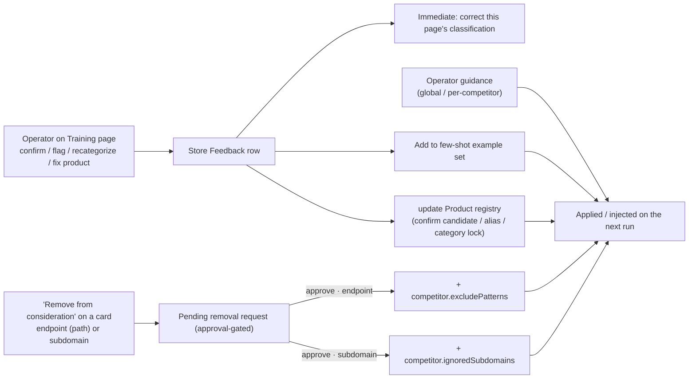

# Inference Training & Relevance Policy — Design

Status: **Phases A, B & C shipped** · Phase D proposed
Owner: Jake · Last updated: 2026-06-11

This document is the scope-of-record for how the inference layer decides **what a
page is about** and **whether it matters**, and how operator feedback makes those
decisions more consistent over time. Changes to the policy (rubric, tracked
products, ignore rules) are reflected here and in the generated
[`relevance-policy.md`](./relevance-policy.md) (Phase C).

Related: [pipeline-reference.md](./pipeline-reference.md) ·
[inference.py](../tools/inference.py) · the Sources page (endpoint & subdomain exclusion).

---
## 1. Goal & the honest constraint

We want classification to be **more deterministic** about:

- the **product** a page is about, and its **category**,
- whether the page is a **relevant** competitive signal,
- a **relevance score** (0–100) we can later gate automations on.

> **Reality check:** an LLM is not deterministic, and our current inference path
> (ChatGPT-OAuth via Codex) does not even expose `temperature`. So determinism does
> **not** come from the model. It comes from constraining the decision and wrapping
> the model in deterministic logic:
>
> 1. a fixed, versioned **rubric** + **structured output** (a fixed ruler),
> 2. a **known-product registry** so product/category is mostly a lookup,
> 3. **deterministic pre/post rules** (endpoint/pattern & subdomain filters, category locks),
> 4. **operator feedback** that feeds both the rules and a few-shot example set.
>
> The model handles the fuzzy middle; its output is constrained and then corrected.

---

## 2. The relevance rubric (v1)

Relevance = confidence that the page reports a **new product** or a **new feature on
an existing product** from a competitor.

| Score | Band | `signal_type` | Examples |
|---|---|---|---|
| 90–100 | New product launch / flagship capability | `new_product` | "Introducing <NewThing>", a distinct new product line |
| 70–89 | New feature on an existing product | `new_feature` | "Scribe v2", new API capability, new model version |
| 40–69 | Incremental update | `update` | latency/perf, pricing change, regional rollout |
| 15–39 | Tangential | `tangential` | customer story, webinar recap, partnership, case study |
| 1–14 | Irrelevant | `irrelevant` | careers, legal, brand assets, events, generic marketing |

- **`relevant` (boolean)** = `relevance_score >= RELEVANCE_THRESHOLD` (**default 40**,
  tunable). So customer stories/webinars (15–39) default to *not relevant* — this is
  what was over-surfacing in the ElevenLabs run.
- **Automation target:** the later automations key on `new_product`/`new_feature`
  (≥70). Those should trend toward high confidence; the feedback loop closes gaps
  when the model under-scores a real launch.
- The rubric carries a **`rubric_version`** (e.g. `v1`) stored on every
  classification, so we can detect drift and re-score when the rubric changes.

Open for confirmation: the 40 threshold, and whether `tangential` should be 15–39
(default) or forced to 0 (treated as irrelevant).

---

## 3. Data model changes

**`Classification` (extend existing):** add `relevanceScore Int?`, `signalType
String?`, `product String?`, `reasoning String?`, `rubricVersion String?`. (Keeps
existing `relevant`, `category`, `summary`, `model`.)

**`Product` (new):** per-competitor catalog. `name`, `category`, `aliases`
(JSON string[]), `status` (`active` | `candidate` | `deprecated`),
`firstSeenPageId?`. Unique `(competitorId, name)`. Seeded once from known products,
grown via "candidate" rows the operator confirms.

**`Feedback` (new):** one row per operator action on a page. `action`
(`confirm` | `flag_irrelevant` | `recategorize` | `reassign_product`),
`reasonCategory` (enum below), `reason` (free text), `operator` (email),
`createdAt`. This is the durable record that "feeds back into future runs."

`reasonCategory` enum (drives rule derivation): `marketing`, `customer_story`,
`careers_or_legal`, `wrong_subdomain`, `duplicate`, `wrong_product`,
`wrong_category`, `not_a_release`, `other`.

---

## 4. Classification flow (new)

The pre-filter is where the **endpoint/subdomain exclusion** already lives — an operator
removing a noisy endpoint (path) or subdomain from a card just adds to it (approval-gated).

---

## 5. The feedback loop

Two channels, exactly as chosen:

- **Deterministic rules** — endpoint exclusions (→ `excludePatterns`) and subdomain
  removals (→ `ignoredSubdomains`) created via the approval-gated card action, plus
  Product-registry edits. 100% repeatable; no model involvement. Reuses the plumbing
  we already built, so the next run respects them immediately.
- **Few-shot examples** — the corrected `(page → label, reason)` is added to a
  per-competitor example pool. Up to N (≈8) recent, compact examples (title, host,
  signal_type, score, one-line reason) are injected into the classify prompt so the
  model aligns with past operator judgments.

Safety for later automations: high score **and** matching rules → safe to auto-act;
low/uncertain → routed to the Training queue (which produces more feedback).

---

## 6. Surfaces & API

**Training/Review page** (`/training`): a queue that **mirrors the Feed** — the full
set of scored, relevant items, newest first, paginated (not a low-confidence subset)
— so an operator can review everything and establish a baseline. Items already
reviewed are marked. Plus candidate products awaiting confirmation and the guidance /
approvals panels. Per item: confirm, flag-irrelevant (+ reason category + text),
recategorize, reassign product.

> Why mirror the feed (not just borderline items): the first pass is about
> establishing a trustworthy starting point across the whole feed; once a baseline of
> feedback exists, a "needs attention" view (borderline + unreviewed) can be layered on
> as a filter rather than the default.

New endpoints:
- `GET  /api/feedback/queue?competitor=&relevant=&page=` — feed-mirroring review queue (paginated; each item carries a `reviewed` flag).
- `POST /api/pages/:id/feedback` — record a feedback action (+ immediate correction).
- `GET/POST/PATCH/DELETE /api/products` — product registry CRUD + confirm candidate.
- `GET /api/removal-requests` · `POST :id/approve|:id/reject` — endpoint/subdomain removal approvals.
- `GET/POST/PATCH/DELETE /api/guidance` — operator guidance (global / per-competitor).
- `POST /api/policy/regenerate` — regenerate `relevance-policy.md`.

---

## 7. Living policy doc (the "scope in markdown")

`docs/relevance-policy.md` is **generated** from the DB (Phase C) and regenerated on
demand or after feedback. It mirrors current scope so changes are auditable:

- the rubric + version and threshold,
- per-competitor **tracked products** and their categories,
- active **exclusion rules** (excluded endpoints, ignored subdomains) and where they came from,
- a recent-feedback summary (what's been flagged and why).

This file + this design doc are the two markdown artifacts; rubric/threshold edits
bump `rubric_version` and show up in both.

---

## 8. Phasing

| Phase | Scope | Deliverable |
|---|---|---|
| **A** ✅ | Schema (Classification fields, `Product`, `Feedback`), rubric prompt + structured output + 0–100 scoring, seed product registry | **Shipped** — runs produce product/category/score/signal_type/reasoning; verified on ElevenLabs (23/73 relevant) |
| **B** ✅ | Training page + feedback endpoints + immediate correction | **Shipped** — `/training` queue **mirrors the feed** (paginated, reviewed-flagged) + candidate products; flag/recategorize/reassign with reasons; scores surfaced on the feed |
| **C** ✅ | Plain-text guidance + few-shot injection + endpoint/subdomain removal approval workflow + `relevance-policy.md` generator | **Shipped** — guidance & corrections inject into the next run; endpoint/subdomain removal is approval-gated and lands in Sources |
| **D** (later) | Automations consuming `relevance_score` | Out of scope here |

---

## 9. Open questions

1. Confirm `RELEVANCE_THRESHOLD = 40` and the `tangential` band (15–39 vs forced 0).
2. Seed the **product registry** how? Options: (a) I mine the existing archived
   ElevenLabs/Deepgram pages to draft an initial catalog for your review, or
   (b) start empty and let "candidate" products accumulate from runs.
3. `category` today = product category (AI Assistants / Inference / STT / TTS /
   Other). Keep this taxonomy, or do you want a separate, finer product-category
   list distinct from the focus areas?
4. Few-shot examples will be sent through your ChatGPT subscription (more tokens per
   run). Acceptable, or cap example count tightly?
