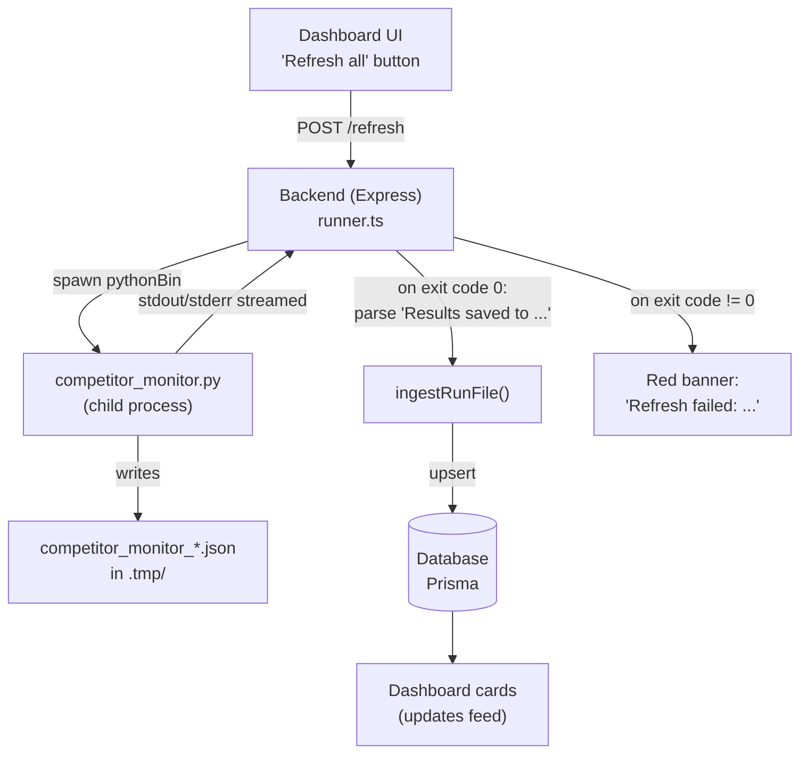
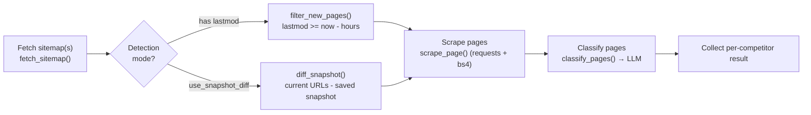
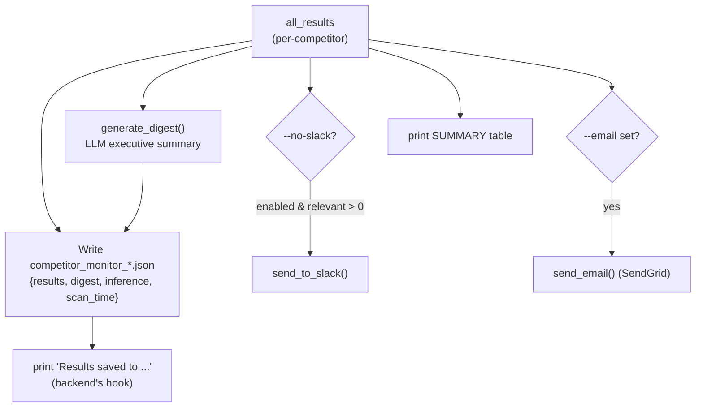
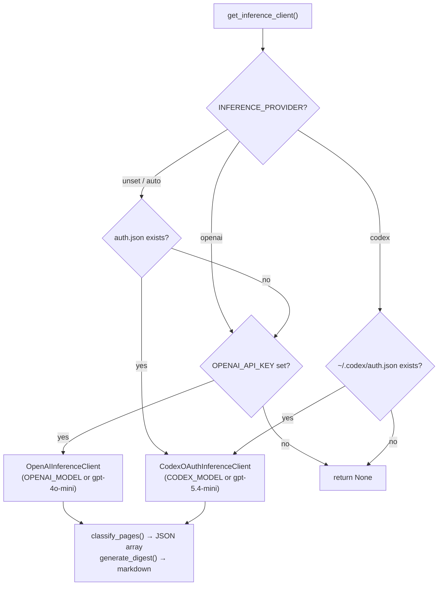

# Competitor Monitor — Pipeline Reference

A reference for how the **Competitor Intelligence** pipeline works end to end: what the
dashboard triggers, what the Python process does stage by stage, and where each piece of
configuration lives.

- **Pipeline entry point:** [`tools/competitor_monitor.py`](../tools/competitor_monitor.py)
- **Inference layer:** [`tools/inference.py`](../tools/inference.py)
- **Dashboard backend (spawns the pipeline):** [`dashboard/backend/src/runner.ts`](../dashboard/backend/src/runner.ts), [`config.ts`](../dashboard/backend/src/config.ts)
- **Source registry (human-readable):** [`PLG-67-source-registry.md`](../PLG-67-source-registry.md)

---

## 1. High-level flow

The dashboard's **Refresh all** button does *not* run any scraping itself. It asks the
backend to spawn the Python pipeline as a child process, waits for it to exit, then ingests
the JSON artifact the pipeline writes.



**Key contract:** the backend finds the output file by regex-matching the literal line
`Results saved to <path>.json` in the pipeline's stdout
([runner.ts:109](../dashboard/backend/src/runner.ts#L109)). If the pipeline exits non-zero,
the backend surfaces the tail of the log as the red banner you saw
([runner.ts:100-106](../dashboard/backend/src/runner.ts#L100-L106)). If it exits 0 but that
line is missing, the job fails with "Could not locate pipeline output artifact."

### Which Python runs it

`runner.ts` spawns `config.pythonBin`, resolved in this order
([config.ts](../dashboard/backend/src/config.ts)):

1. `PYTHON_BIN` env var, if set
2. repo-local `./.venv/bin/python`, if it exists  ← **preferred; guarantees deps are present**
3. bare `python3` from `PATH` (fallback)

> The original "No module named 'bs4'" failure happened because step 3 resolved to a
> Python interpreter that didn't have `beautifulsoup4` installed. Creating `.venv` with
> `requirements.txt` installed fixes this deterministically, independent of shell `PATH`.

---

## 2. Pipeline stages (per competitor)

`run_monitor()` ([competitor_monitor.py:673](../tools/competitor_monitor.py#L673)) loops over
the selected competitors. For each one:



| Stage | Function | Notes |
|---|---|---|
| **Fetch** | `fetch_sitemap()` | Recurses into sitemap indexes. Network failures warn and return `[]` (non-fatal). |
| **Detect** | `filter_new_pages()` **or** `diff_snapshot()` | Chosen per competitor via the `use_snapshot_diff` flag. See below. |
| **Scrape** | `scrape_page()` | `requests` + BeautifulSoup; strips nav/footer/script, keeps title, meta description, first 2000 chars of main text. Skipped with `--no-scrape`. |
| **Classify** | `classify_pages()` | One LLM call per competitor classifying all its new pages. Skipped with `--no-classify`. Soft-degrades if no key (see §4). |

### Two detection modes

Competitors are configured in the `COMPETITORS` list
([competitor_monitor.py:58](../tools/competitor_monitor.py#L58)):

- **lastmod mode** (default): keeps pages whose sitemap `<lastmod>` is within the
  `--hours` window. Used when the site publishes reliable `lastmod` dates
  (e.g. ElevenLabs, Twilio, Bland AI).
- **snapshot-diff mode** (`use_snapshot_diff: true`): for sites with no usable `lastmod`.
  Compares the current sitemap URL set against a saved snapshot in
  `.tmp/snapshots/<name>_sitemap.json` and treats newly-appeared URLs as "new."
  Used for Vapi, Retell AI, AssemblyAI, and the inference platforms
  (Together AI, Baseten, Fireworks AI, RunPod, Modal, Replicate).

> **First-run caveat for snapshot-diff competitors:** with no prior snapshot, the first run
> saves a baseline and reports **0 new pages** ([competitor_monitor.py:308-311](../tools/competitor_monitor.py#L308-L311)).
> You need a second run for diffs to appear.

Each competitor also has `include_patterns` / `exclude_patterns` (regexes against the URL)
to keep the feed scoped to AI/voice-relevant sections and drop legal/careers/privacy noise.

---

## 3. Aggregation, output, and delivery

After all competitors are processed:



| Step | Function | Gating |
|---|---|---|
| **Digest** | `generate_digest()` | Only if classification is on. One LLM call over all *relevant* pages → markdown exec summary. Returns `None` if no inference client. |
| **Save JSON** | inline in `run_monitor()` | Always. This is the artifact the dashboard ingests. |
| **Slack** | `send_to_slack()` | Skipped with `--no-slack`. Also skipped if 0 relevant updates. Channel: `SLACK_COMPETITOR_CHANNEL` (default `#product-intel`). |
| **Email** | `send_email()` | Only if `--email <addr>` passed. Requires `SENDGRID_API_KEY` + `SENDGRID_SENDER_EMAIL`. |

### Output JSON shape

```jsonc
{
  "results": [
    {
      "competitor": "ElevenLabs",
      "total_sitemap_urls": 1234,
      "new_pages": [
        {
          "url": "https://elevenlabs.io/blog/...",
          "lastmod": "...",
          "source": "snapshot_diff",          // only in snapshot-diff mode
          "scraped": { "title": "...", "description": "...", "text_preview": "...", "text_length": 0 },
          "classification": { "relevant": true, "category": "TTS", "summary": "..." }
        }
      ],
      "checked_at": "..."
    }
  ],
  "digest": "…markdown executive summary…",     // or null
  "inference": { "provider": "openai", "model": "gpt-4o-mini" }, // or null if no key
  "scan_time": "...",
  "hours": 24
}
```

---

## 4. Inference layer

[`tools/inference.py`](../tools/inference.py) wraps the LLM provider behind a small
`InferenceClient` protocol. There are **two** implementations, sharing the same
prompt-building and JSON-parsing code:

- **`OpenAIInferenceClient`** — the OpenAI **API** (`OPENAI_API_KEY`), chat-completions
  over plain `requests`. Billed against **API credits** (separate from any ChatGPT
  subscription).
- **`CodexOAuthInferenceClient`** — your **ChatGPT subscription**, via the "Sign in with
  ChatGPT" OAuth token that the Codex CLI stores in `~/.codex/auth.json`. Calls the
  ChatGPT backend Responses API at `chatgpt.com/backend-api/codex/responses`. **Uses no
  API credits.** This is the same mechanism other ChatGPT-OAuth tools use.



### Codex OAuth specifics

- **Token handling:** reads `access_token` / `refresh_token` / `account_id` from
  `auth.json`. When the access token is within ~5 min of expiry it refreshes against
  `auth.openai.com/oauth/token` (client id `app_EMoamEEZ73f0CkXaXp7hrann`) and writes the
  new tokens back atomically (same file Codex itself uses).
- **Models:** the ChatGPT-account Codex backend only serves the frontier `gpt-5.4` /
  `gpt-5.4-mini` models. The `-codex` variants (e.g. `gpt-5.1-codex`) and plain `gpt-5`
  return `400 … not supported when using Codex with a ChatGPT account`. Default is
  `gpt-5.4-mini`; override with `CODEX_MODEL`.
- **Wire format:** streaming Responses API (`stream: true`, `store: false`,
  `OpenAI-Beta: responses=experimental`, `chatgpt-account-id` header). Output text is
  reassembled from `response.output_text.delta` SSE events.
- **Caveat:** this routes a non-ChatGPT workload through the consumer subscription — a gray
  area under OpenAI's consumer ToS. It's the same path Codex uses for coding.

**Soft-gating is the key behavior.** When `OPENAI_API_KEY` is absent,
`get_inference_client()` returns `None` and the pipeline does *not* fail — it marks every
page `category: "unclassified"`, `relevant: true`, and still exits 0
([competitor_monitor.py:420-429](../tools/competitor_monitor.py#L420-L429)). So an
"everything is unclassified" dashboard is the tell-tale sign that inference didn't run.
**Note:** the same `unclassified` fallback also fires when the inference *call* fails for a
configured key — e.g. an OpenAI `429 Too Many Requests` or a timeout
([competitor_monitor.py:471-479](../tools/competitor_monitor.py#L471-L479)). So check stderr:
`OPENAI_API_KEY not set` means no key, whereas `LLM classification failed: 429 …` means the
key works but the provider throttled/rejected the request.

To make a missing/broken inference config **fail loudly** instead, pass
`--require-inference` ([competitor_monitor.py:694-698](../tools/competitor_monitor.py#L694-L698));
the backend sets this when the refresh request includes `requireInference`.

Relevant env vars: `OPENAI_API_KEY` (required for inference), `OPENAI_MODEL`
(default `gpt-4o-mini`), `OPENAI_BASE_URL` (default `https://api.openai.com/v1`).

---

## 5. CLI flags

```
python tools/competitor_monitor.py [options]

  --competitor NAME     Run only the named competitor (repeatable). Omit = all.
  --hours N             Look-back window for lastmod mode (default: 24).
  --no-scrape           Skip fetching page content.
  --no-classify         Skip LLM classification and the digest.
  --require-inference   Fail hard if no inference client is configured.
  --no-slack            Skip the Slack notification.
  --email ADDR          Also send an HTML digest via SendGrid.
  --output-dir DIR      Where the JSON artifact is written (default: .tmp).
  --json-only           Also dump results JSON to stdout.
```

Example used for a fast single-competitor smoke test:

```bash
.venv/bin/python tools/competitor_monitor.py \
  --competitor ElevenLabs --hours 24 --output-dir .tmp --no-slack
```

---

## 6. Environment variables

| Variable | Purpose | Used by |
|---|---|---|
| `PYTHON_BIN` | Override the interpreter the backend spawns | `config.ts` |
| `INFERENCE_PROVIDER` | Force provider: `openai` or `codex` (unset = auto, prefers Codex OAuth if `auth.json` exists) | `inference.py` |
| `OPENAI_API_KEY` | Enables the OpenAI **API** provider | `inference.py` |
| `OPENAI_MODEL` | API model id (default `gpt-4o-mini`) | `inference.py` |
| `OPENAI_BASE_URL` | API base (default OpenAI) | `inference.py` |
| `CODEX_MODEL` | ChatGPT-OAuth model (default `gpt-5.4-mini`) | `inference.py` |
| `CODEX_HOME` / `CHATGPT_LOCAL_HOME` | Override location of Codex `auth.json` | `inference.py` |
| `SENDGRID_API_KEY` / `SENDGRID_SENDER_EMAIL` | Email delivery | `send_email()` |
| `SLACK_COMPETITOR_CHANNEL` | Slack target channel (default `#product-intel`) | `send_to_slack()` |
| `PIPELINE_SCRIPT` / `PIPELINE_OUTPUT_DIR` / `PORT` | Backend wiring overrides | `config.ts` |

The pipeline loads these from `local/.env`, then repo-root `.env`, then cwd `.env`
([competitor_monitor.py:32-40](../tools/competitor_monitor.py#L32-L40)). Keep secrets in
`local/.env` (gitignored), never in source-controlled config.

---

## 7. Failure modes cheat-sheet

| Symptom | Likely cause |
|---|---|
| `Refresh failed: ... No module named 'bs4'` | Backend spawned a Python without deps. Ensure `.venv` exists with `requirements.txt` installed, or set `PYTHON_BIN`. |
| Everything shows `unclassified`, digest `null`, but no "key not set" warning | Inference call **failed** (e.g. `429 Too Many Requests`, timeout). Key is present but the provider rejected the call → soft-degraded. Check stderr for the actual error. |
| Everything shows `unclassified` + `Warning: OPENAI_API_KEY not set` | No key configured → inference soft-degraded. |
| Snapshot-diff competitor shows 0 new on first run | Expected — baseline saved; diffs appear from the 2nd run. |
| "Could not locate pipeline output artifact" | Pipeline exited 0 but didn't print `Results saved to ...` (e.g. crashed after partial output). |
| Slack/email silently absent | `--no-slack` set, 0 relevant updates, or missing SendGrid/Slack env. |
</content>
</invoke>
